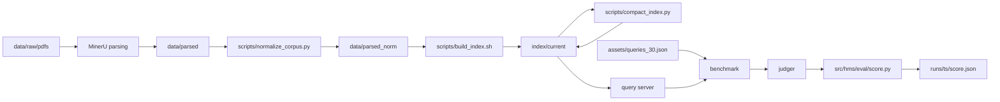

# Architecture

## Data flow

Parsing is not automated here. MinerU's own runtime is heavy and its output is
stable, so `data/parsed` is treated as an input and the pipeline starts from it.

## Module boundaries

| Path | Responsibility |
| --- | --- |
| `src/hms/paths.py` | Every filesystem location, resolved once from `HMS_ROOT` |
| `src/hms/logging_setup.py` | stdout plus rotating per-step file logging |
| `src/hms/normalize/numeric.py` | Pure math-span rewriting, no I/O |
| `src/hms/normalize/blocks.py` | Structural block predicates, no I/O |
| `src/hms/index/compact_vdb.py` | nano-vectordb compaction, atomic replace |
| `src/hms/eval/score.py` | Score formula and penalty breakdown |
| `scripts/` | Argument parsing, orchestration, shell entry points |
| `third_party/RAG-Anything/` | Vendored baseline, read-only |

Library code is import-clean: the only third-party import anywhere under
`src/hms` is the standard library. This keeps `uv sync` at zero runtime
dependencies and lets the same modules run on the NPU machine without a pip
install step.

## The normalizer

`normalize_text` only rewrites the inside of `$...$` spans. Prose, table bodies
and captions are returned byte-for-byte, which keeps the change auditable:
normalizing a corpus produces a tree that differs from `data/parsed` solely in
the math spans and in `img_path`.

The rewrite is a fixed-point iteration over an ordered rule table
(`src/hms/normalize/numeric.py`). One pass can enable another, for example
unwrapping `\mathrm { k g }` to `k g` before the single-letter run collapses it
to `kg`. Iteration stops when a pass changes nothing, and the result is
idempotent, so re-running the corpus script never drifts.

Two details are worth calling out:

- MinerU writes the escaped space `\ ` around relation symbols, producing
  `11 \ = \ 21`. That is handled by the `escaped_space` rule rather than by the
  relation rule, which only matches `\=`.
- `sign_glue` is deliberately restricted to `+` and `-` so that it fixes the
  exponent in `{ - 2 }` without collapsing the spacing around `=`.
- Span detection is escape aware. MinerU writes currency as `$\$ 2 8$`, and a
  naive `\$[^$]+\$` scanner pairs that closing `$` with the next opening one,
  which silently strips the whitespace of the prose between them.

Verified on the full 100 document corpus. Of 14,881 source blocks, 14,869 are
written, 1,629 text fields are rewritten, and 12 blank multimodal blocks are
dropped:

- aligning every non-dropped block against its source counterpart shows no
  field differences other than `text` and `img_path`;
- the multiset of digit characters is identical before and after in all 1,629
  rewritten fields, so no numeral is dropped or invented;
- exactly the 12 known blank blocks are removed, and nothing else;
- re-running is a no-op.

## Why the compaction is safe

LightRAG's `NanoVectorDBStorage.upsert` writes each embedding twice: once into
the `matrix` block as float32, and once per record as `base64(zlib(float16))` in
a `vector` field. `NanoVectorDBStorage.query` iterates results with
`if k != "vector"`, so the per-record copy is never read back.

Verified against the reference store before changing anything. Decoding record
*N*'s `vector` and comparing it with row *N* of `matrix` gives a maximum
absolute difference of 5e-5, which is float16 resolution, and both rows pick the
same argmax. Measured redundancy:

| Store | Size | `vector` payload | Share |
| --- | --- | --- | --- |
| `vdb_chunks.json` | 38.6 MB | 10.3 MB | 26.7% |
| `vdb_entities.json` | 365.5 MB | 111.2 MB | 30.4% |
| `vdb_relationships.json` | 655.1 MB | 200.5 MB | 30.6% |

`compact_file` therefore removes only `data[*]["vector"]` and leaves `matrix`,
record ids, metadata and ordering untouched. It writes to `*.json.tmp` and then
`os.replace`, so an interrupted run leaves the original file intact.

Note that even after compaction the relation store stays near 455 MB, well past
GitHub's 100 MB per-file limit. Committing an index is not an option; see
`docs/data.md`.

## Run artifacts

Each step creates `runs/<timestamp>_<step>/` containing its own log, a
machine-readable report and, for evaluation, the score breakdown. The vendored
baseline writes its store under `index/` and its logs and results under the run
directory, so `third_party` never accumulates generated files.
